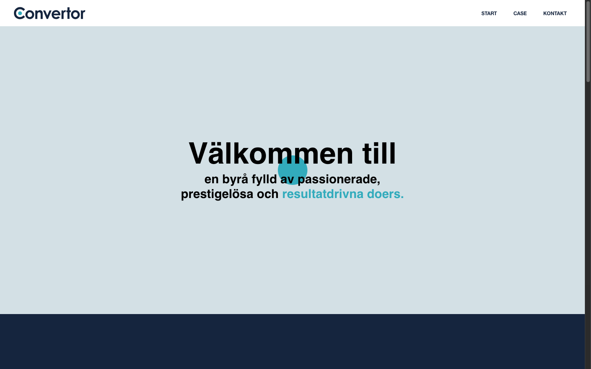
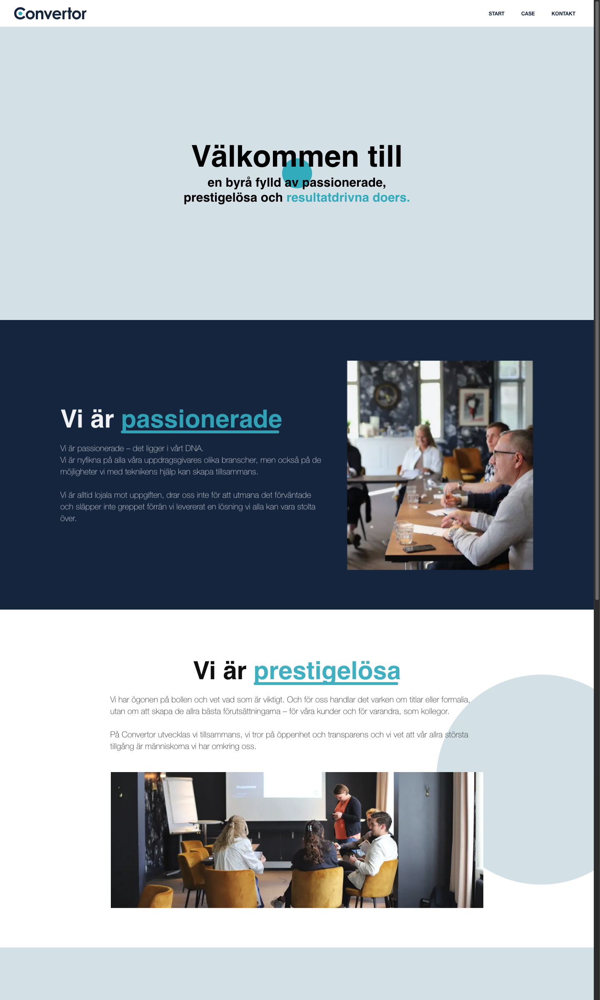

# Convertor Interactive E-Book

Scroll-driven brand story microsite for **[Convertor Svenska AB](https://convertor.se/)** (Malmö), built during a **frontend internship (February–May 2024)**. The experience keeps the original agency palette and narrative sections while running on a modernized **Next.js** stack with smoother motion and stable touch/scroll hero interaction.



## Live site

- **Production:** [convertor-e-book.netlify.app](https://convertor-e-book.netlify.app/)

## Topics

`nextjs` · `react` · `typescript` · `tailwindcss` · `netlify` · `scroll-animation` · `brand-microsite` · `internship-project` · `convertor` · `single-page-application`

## Project overview

A single-page editorial site with five narrative beats:

| Section | Theme |
| --- | --- |
| Welcome | Scroll-scaled hero ellipse + headline |
| Passionate | Team culture + photography |
| Prestigeless | Values + workshop imagery |
| Results-driven | Measurable outcomes |
| Doers | Closing statement |

Navigation and footer link to the real agency site ([convertor.se](https://convertor.se/)), customer cases, contact, and social profiles (Facebook, LinkedIn, Instagram).



## Internship context

| | |
| --- | --- |
| **Organization** | [Convertor Svenska AB](https://convertor.se/) |
| **Period** | February – May 2024 |
| **Role** | Frontend internship — interactive landing / e-book presentation |
| **Focus** | Brand storytelling, scroll UX, responsive layout, client-ready polish |

## What this demonstrates

- Translating an agency brand guide into a web-native reading flow
- Custom scroll + touch hero without heavy animation libraries
- Intersection-based reveals, accent underlines, and subtle parallax blobs
- Accessible patterns (`prefers-reduced-motion`, semantic landmarks, external links)
- Continuous deployment on Netlify from `main`

## Tech stack

- Next.js 15 (App Router)
- React 19
- TypeScript
- Tailwind CSS 3

## Local development

```bash
npm install
npm run dev
```

Open [http://localhost:3000](http://localhost:3000).

## Production build

```bash
npm run build
npm run start
```

## Netlify deployment

Configured via [`netlify.toml`](./netlify.toml) with `@netlify/plugin-nextjs`.

| Setting | Value |
| --- | --- |
| Build command | `npm run build` |
| Production branch | `main` |
| Plugin | `@netlify/plugin-nextjs` |

Historical semver tags are mirrored to `deploy/v*` branches (see [`.github/workflows/sync-deploy-branches.yml`](./.github/workflows/sync-deploy-branches.yml)) for optional branch deploy previews.

## Version history

| Tag | Notes |
| --- | --- |
| `v0.1.0` | Initial build (March 2024) |
| `v0.2.0` – `v0.5.0` | Scroll, mobile, and touch iterations (April 2024) |
| `v1.0.0` | Modernized stack, shared reveal hooks, Netlify workflow |

## Screenshots

| View | |
| --- | --- |
| Desktop hero |  |
| Mobile hero |  |

## Repository naming

Canonical repo: **`convertor-interactive-ebook`** (formerly `ebook-converter-app` / `convertor-e-book`). The name reflects an interactive brand e-book microsite rather than a file-format converter.

## License

Internship deliverable for Convertor Svenska AB. Agency assets and copy remain their property.
